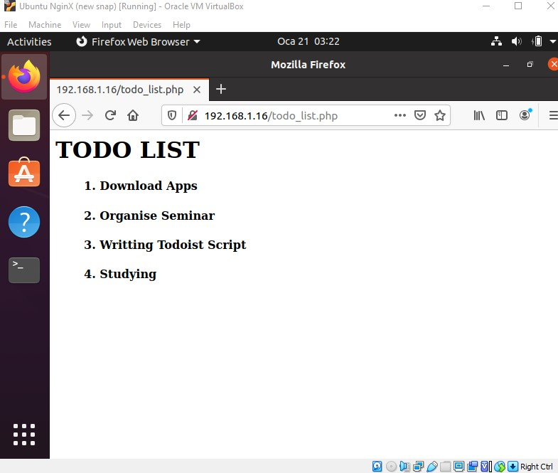

<!-- #  STEPS TAKEN -->

## Step 1 – Installing the Nginx Web Server

<p> I became a root user using sudo -i  to make work easier and faster for me. I went along to update the apt repositories/packages on my Ubuntu OS using the command.</p>

```
# sudo -i
# apt update 
```
<p>I installed Nginx WebServer onto the OS using the command with the -y so that it will not prompt the Yes or No to install the package.</p>

```
# apt -y install Nginx
```
<p>I enabled my firewall using the command below to give access to the Nginx webserver.</p>

```
# ufw enable
```
<p>I allow the firewall to accept connections onto the machine using tcp port 22 using this command and also browsed through the localhost to check if the Nginx webserver has been successfully installed.</p>

```
# ufw allow ssh
```
## Step 2 — Installing MySQL
<p>I went ahead to install mysql server and I also configured the root password after the installation using the command below with -y to ignore any prompt.</p>

```
# apt -y install mysql-server

# mysql_secure_installation
```

<p>I verified if mysql is fully installed and working using the command.</p>

```
# mysql
```
## Step 3 – Installing PHP
I installed PHP and all the Modules that will allow it communicate with Nginx and Mysql.

```
# apt install php libapache2-mod-php php-mysql
```
Run this command to know if the PHP has been installed successfully.

```
# php -v 
```
## Step 4 — Configuring Nginx to Use the PHP Processor
I create a directory in `/var/www/my_domain` for the my_domain website because Nginx has one server block enabled by default and is configured to serve documents out of a directory at `/var/www/html` and I changed the ownership of the file from  root to my user.
```
# mkdir /var/www/my_domain
# chown -R USER:USER /var/www/my_domain
```
I created a new configuration file in Nginx’s `sites-available` directory using nano editor and configured it with the configuration below.

```
# nano /etc/nginx/sites-available/my_domain

server {
    listen 80;
    server_name my_domain www.my_domain;
    root /var/www/my_domain;

    index index.html index.htm index.php;

    location / {
        try_files $uri $uri/ =404;
    }

    location ~ \.php$ {
        include snippets/fastcgi-php.conf;
        fastcgi_pass unix:/var/run/php/php7.4-fpm.sock;
     }

    location ~ /\.ht {
        deny all;
    }

}
```
I activated the configuration file by soft linking it to the config file from Nginx’s `sites-enabled` directory and also testing the config file for error free.

```
# ln -s /etc/nginx/sites-available/my_domain /etc/nginx/sites-enabled/

# nginx -t
```

I reloaded the Nginx so as to apply the changes made in the config file.
```
# systemctl reload nginx
```
I created an index.html file in the web root /var/www/my_domain directory for the webserver to use for displaying the content of my website using nano editor and input some codes.
```
$ nano /var/www/my_domain/index.html

<html>
  <head>
    <title>my domain website name here</title>
  </head>
  <body>
    <h1>Testing My Nginx Web Sever</h1>

    <p>Thanks for the opportunity given <strong>Yusuff</strong>.</p>
  </body>
</html>
```
# Nginx Test Page


## Step 5 –Testing PHP with Nginx
I created a test PHP file in my document root `/var/www/my_domain`. info.php within my document root using nano text editor with the following codes.
```
$ nano /var/www/my_domain/info.php

<?php
phpinfo();
?>
```
# PHP Test Page

## Step 6 — Testing Database Connection from PHP
I connected to the MySQL console using my root account.
```
$ sudo mysql
```
I created a new database and run the following command from my MySQL console.
```
mysql> CREATE DATABASE Yusuff;
```
I created a new user named ysf, using ``mysql_native_password` as default authentication method. And also give ysf the permission over the Yusuff database:
```
mysql>  CREATE USER 'ysf'@'%' IDENTIFIED WITH mysql_native_password BY 'mypassword';

mysql> GRANT ALL ON Yusuff.* TO 'ysf'@'%';
```
Exit MySQL console, I went ahead to test if the new user I created has the proper permissions by logging in to the MySQL console again, this time using the new user credentials with -p to prompt for the password created along with the new user.
```
mysql> exit

$ mysql -u ysf -p
```
```
mysql> SHOW DATABASES;
```
<!-- Showing the Database on mysql-->
|Database |
-----------
|Yusuff |  
|information_schema|
|                  |
2 rows in set (0.25 sec)

I created a PHP script that will connect to MySQL and query for the  content I inputed. I created a new PHP file in my web root directory `/var/www/my_domain` using nano editor.
```
$ nano /var/www/my_domain/todo_list.php
```
The following PHP script connects to the MySQL database and queries for the content of the todo_list table, exhibiting the results in a list. If there’s a problem with the database connection, it will throw an exception.
```
<?php
$user = "ysf";
$password = "mypassword";
$database = "Yusuff";
$table = "todo_list";

try {
  $db = new PDO("mysql:host=localhost;dbname=$database", $user, $password);
  echo "<h2>TODO LIST</h2><ul>";

  echo "<h4>1. Download Apps</h4>";
  echo "<h4>2. Organise Seminar</h4>";
  echo "<h4>3. Writting Todoist Script</h4>";
  echo "<h4>4. Studying</h4>";

  foreach($db->query("SELECT content FROM $table") as $row) {
    echo "<li>" . $row['content'] . "</li>";
  }
  echo "</ul>";
} catch (PDOException $e) {
    print "Error!: " . $e->getMessage() . "<br/>";
    die();
}
```
I can now access this page in my web browser by visiting the domain name or public IP address configured for my website or buy using the default localhost, followed by /todo_list.php.
```
http://localhost/todo_list.php
```
# TODO LIST Page



